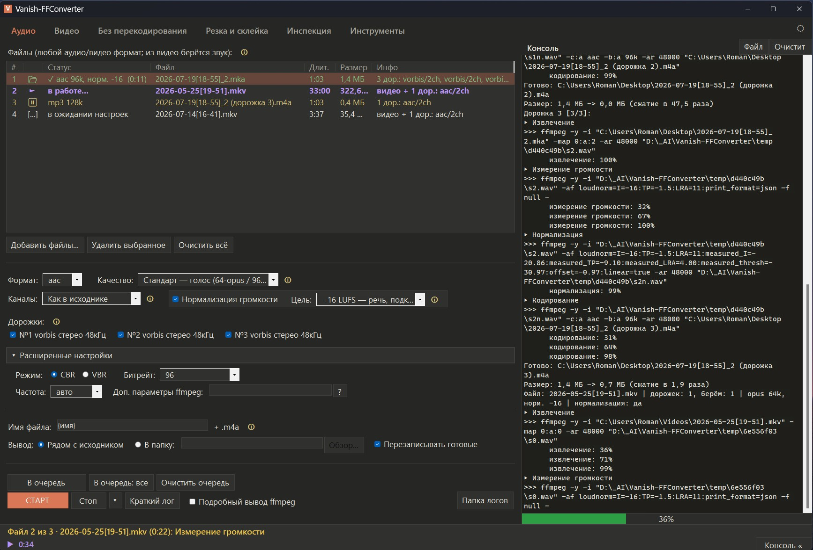

# Vanish-FFConverter

Простая графическая оболочка для **ffmpeg** под Windows. Цель — сделать
максимально понятный инструмент для повседневных задач с аудио и видео,
чтобы не держать в голове командную строку ffmpeg. Одна портативная
программа + папка `ffmpeg`, без установки.

> ⚠️ **Проект в разработке.** Сейчас доделывается первая вкладка —
> **«Аудио»**. Остальные вкладки присутствуют в интерфейсе как заглушки
> и будут реализованы в следующих версиях.

## Что планируется (вкладки)

| Вкладка | Что делает | Статус |
|---|---|---|
| **Аудио** | конвертация/сжатие звука, нормализация громкости, работа с дорожками | ✅ работает |
| **Видео** | сжатие видео (H.264/H.265), смена разрешения, «уложиться в размер» | 🚧 запланировано |
| **Без перекодирования** | смена контейнера (mp4/mkv/mka), извлечение и удаление дорожек | 🚧 запланировано |
| **Резка и склейка** | обрезка по таймкодам, нарезка на части, склейка | 🚧 запланировано |
| **Инспекция** | что внутри файла: кодеки, дорожки, битрейт (ffprobe) | 🚧 запланировано |
| **Инструменты** | кадр из видео, GIF, изменение скорости, поворот, метаданные | 🚧 запланировано |

## Вкладка «Аудио» — что уже умеет

- **Форматы:** opus, mp3, aac (в контейнере .m4a), flac, wav.
- **Пресеты качества** (компактный/стандарт/высокое/максимум) и
  **расширенный режим** с ручной настройкой битрейта, режима CBR/VBR,
  частоты дискретизации и полем «доп. параметры ffmpeg».
- **Нормализация громкости** по стандарту EBU R128 (двухпроходный
  loudnorm) с выбором целевого уровня LUFS.
- **Работа с дорожками мультитрека:** выбор нужных дорожек, сведение в
  моно, «голоса по ушам» (стерео), либо каждая дорожка в свой файл.
- **Очередь заданий:** постановка отдельных файлов или всех сразу,
  запуск/стоп, пауза после текущего, пропуск, «запустить только это
  задание» (контекстное меню).
- **Прогресс и логи:** зелёный прогресс-бар по текущему файлу, выезжающая
  справа консоль с полной командой ffmpeg, полный лог-файл и краткий итог
  по каждому циклу.
- **Удобства:** перетаскивание файлов в окно, шаблоны имён результата,
  вывод рядом с исходником или в выбранную папку, тёмная и светлая тема.

## Установка и запуск

### Вариант 1. Готовая сборка

1. Скачайте `Vanish-FFConverter.exe` и `get-ffmpeg.bat` (положите рядом).
2. Запустите **`get-ffmpeg.bat`** — он скачает ffmpeg (~180 МБ) в папку
   `ffmpeg\`. Нужен один раз.
3. Запустите **`Vanish-FFConverter.exe`**.

### Вариант 2. Сборка из исходников

1. Запустите **`build.bat`** — он при необходимости сам скачает ffmpeg,
   затем соберёт программу встроенным компилятором `csc`
   (сторонние SDK не нужны).
2. Запустите **`Vanish-FFConverter.exe`**.

## Требования

- Windows 10/11, 64-bit.
- .NET Framework 4.8 (предустановлен в Windows 10/11).
- ffmpeg скачивается скриптом отдельно (см. выше).

## Технологии

Написано на **C# + WinForms**, .NET Framework 4.8. Сборка — встроенным
компилятором `csc.exe`, без внешних зависимостей и NuGet. Программа сама
медиа не декодирует — она вызывает `ffmpeg`/`ffprobe`/`ffplay` как внешние
процессы.

## О ffmpeg

ffmpeg не входит в репозиторий и скачивается отдельно скриптом
`get-ffmpeg.bat` (сборка [BtbN FFmpeg-Builds](https://github.com/BtbN/FFmpeg-Builds),
win64, GPL). ffmpeg распространяется под собственной лицензией.

## Для визуальной резки

Программа работает формами и списками, без таймлайна и предпросмотра.
Для интерактивной резки «глазами» удобнее специализированные редакторы
(например, Machete).
